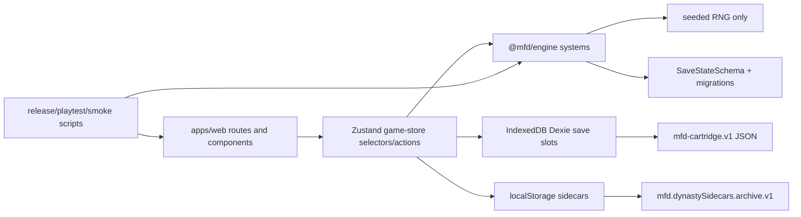

# MFD Project Map

Supersession note: For current release decision context, read `docs/audits/CODEX_DEEP_AUDIT.md` and `docs/audits/FABLE_GOAT_REVIEW.md` before this older map.

Audit date: 2026-06-19

Governing document: `AUDIT_GOAL_MFD.md`. This is audit-only; no source, schema, save, route, build, or gameplay files were changed.

## Evidence Scope

Primary documents read: `AUDIT_GOAL_MFD.md`, `AGENTS.md`, `README.md`, `DESIGN.md`, `STATUS.md`, `CHANGELOG.md`, `CODEX_GAME_GUIDE.md`, `CODEX_IMPROVEMENT_PLAN.md`, `RELEASE_CONVERGENCE.md`, `CODEX_RELEASE_CONVERGENCE_GOAL_PROMPT.md`, `docs/release/MFD_RELEASE_CANDIDATE_HANDOFF.md`, `docs/release/MFD_FINAL_SHIP_DECISION.md`, `_canon/seeds/mfd/README.md`.

Source and tooling facts:

| Fact | Evidence |
| --- | --- |
| Extracted checkout has no git metadata | `test -d .git` returned exit `1`; `RELEASE_CONVERGENCE.md:7-10` documents no `.git` and package-local binaries. |
| Root package pins pnpm but shell has no pnpm | `package.json:5`, `which pnpm` returned `pnpm not found`, `RELEASE_CONVERGENCE.md:10`. |
| Save schema version is 36 | `README.md:7`, `AGENTS.md:35-39`, `RELEASE_CONVERGENCE.md:9`, `packages/engine/src/config/difficulty.ts:93`. |
| Source/tooling scale | 1,644 files under `apps`, `packages`, `scripts`, `.github`, `docs`, `_canon`; 481 tests; 53 web feature folders; 169 engine system modules. |
| Full local release gate exists | `scripts/release-gate.mjs:76-202`; dry-run listed 35 steps. |
| CI/deploy do not run the full gate | `.github/workflows/ci.yml:24-37`, `.github/workflows/ci.yml:55-66`, `.github/workflows/deploy.yml:32-40`. |

## Topology

| Area | Purpose | Inputs | Outputs | Dependencies | UI surfaces | Save deps | Tests | Risk |
| --- | --- | --- | --- | --- | --- | --- | --- | --- |
| `apps/web` | Browser app, routes, Zustand store, Dexie persistence, companion UI | Engine API, store selectors, IndexedDB, localStorage sidecars | Playable single-page app, save slots, route views | React 19, TanStack Router, Zustand, Dexie, design system | All registered routes in `App.tsx` | `GameState` cartridge, IndexedDB slots, browser sidecars | Web Vitest, browser smoke scripts | Medium: large route count, many read-only panels, release smoke scope |
| `packages/engine` | Deterministic football/dynasty engine | GameState, seeded RNG, user decisions | next GameState, events, summaries, reports | Internal systems, Zod save schema | Exports consumed by web | `SaveStateSchema`, migrations, save version | 169 system modules, engine Vitest, playtest harness | Medium: broad state, permissive schema islands |
| `packages/design-system` | Pixel components, Chip, shared UI primitives | Props and theme tokens | UI components | React | All feature screens | None directly | Design tests/typecheck in gate | Low |
| `scripts` | Release gate, browser smokes, playtest, grading, asset generation | Node, package-local bins, Playwright | Gate evidence, generated assets, reports | Node, bash, browser runtime | Release/dev only | No user save writes except smoke test storage | Node script tests | Medium: full gate local-only |
| `.github/workflows` | CI and Pages deploy | Push/PR/workflow dispatch | hosted checks, deploy artifact | pnpm, Node 20 | Release channel | None | Actions | Medium-high: weaker than local gate |
| `_canon/seeds/mfd` | Frozen shadow playtest baselines | playtest reports | drift detector corpus | shadow script | None | no runtime save | shadow-regression | Medium: 20y baseline is truncated with high anomalies |
| `docs`, root ledgers | Roadmaps, status, release context | prior runs, source conclusions | operator guidance | none | none | none | none | Medium: some release docs stale versus June G7 |

## Runtime Architecture

Key import boundaries are guarded by `apps/web/src/app/architecture-boundaries.test.ts`: exported engine imports only, no browser APIs in production engine modules, rivalry sidecar allowlist, direct week sim only behind `store/sim.ts`, and Chip/share scaffold separation.

## Route Map

Primary nav items come from `apps/web/src/app/App.tsx:167-224` and are grouped by `NAV_GROUPS` at `App.tsx:233-242`.

Primary route groups:

| Group | Routes | Notes |
| --- | --- | --- |
| Core | `/`, `/week-advance`, `/watch-list`, `/inbox` | Monday Briefing, advance, saved watch list sidecar, inbox triage. |
| Team | `/roster`, `/depth-chart`, `/locker-room`, `/coaching`, `/handshakes`, `/training-camp`, `/mentors` | Strong team management surface; some coaching/position-coach pieces are read-only. |
| Money | `/contracts`, `/cap-lab`, `/front-office`, `/endorsements` | Mature contract/cap/AGM/front-office surfaces. |
| Acquire | `/trades`, `/trade-block`, `/scouting`, `/draft`, `/free-agency`, `/fa-targets`, `/waivers`, `/practice-squad`, `/team-needs` | Broad acquisition loop; draft-war-room trade application needs scrutiny. |
| Gameday | `/game-day`, `/game-plan`, `/broadcast`, `/presentation`, `/play-by-play`, `/game-flow`, `/film-room`, `/schedule`, `/super-bowl` | Strong loop visibility; trick plays are planning-only. |
| League | `/standings`, `/power-rankings`, `/league-pulse`, `/newsroom`, `/news`, `/social`, `/commissioner`, `/cba`, `/league-rules`, `/analytics`, `/records`, `/stat-central` | Strong league read models and governance. |
| Dynasty | `/franchise`, `/owner`, `/legends`, `/legacy`, `/awards`, `/scenarios` | Good identity/history base; some archive routes are sidecar/read-only. |
| System | `/about`, `/credits`, `/faq`, `/dynasty`, `/settings` | Save/load and meta docs. |

Direct-only routes are intentionally outside primary nav and guarded by `apps/web/src/app/nav-items.test.ts:9-35`: `/coaching/relationships`, `/coaching/tree`, `/compare`, `/draft-recap`, `/expansion-draft`, `/franchise/achievements`, `/franchise/book`, `/franchise/career`, `/franchise/chronicle`, `/franchise/eras`, `/franchise/hall`, `/franchise/mvps`, `/franchise/playoff-lore`, `/franchise/scrapbook`, `/franchise/trophy-room`, `/league/weather`, `/legacy/bloodlines`, `/legacy/named-games`, `/player-development`, `/player/$playerId`, `/player/$playerId/timeline`, `/relocate`, `/rivalries`, `/season/recap`, `/trade-deadline`.

Navigation completeness is tested at `apps/web/src/app/nav-items.test.ts:110-216`. Progressive unlock metadata exists, but the current shell deliberately does not use `NAV_UNLOCK_RULES`, `getNavUnlockStatus`, or `isNavItemUnlocked` (`nav-items.test.ts:195-211`).

## Major Engine Systems

| System | Purpose | Inputs | Outputs | UI | Save deps | Tests/evidence | Risk |
| --- | --- | --- | --- | --- | --- | --- | --- |
| `franchise-week.ts` | Weekly phase advance spine | GameState, options, seeded RNG | next state, events, consequences | Week Advance, Game Day, Inbox, all weekly routes | Many `GameState` fields | `franchise-week.ts:590-696`; G4 gate | Medium-high: central blast radius |
| `game-sim.ts` | Drive-by-drive game sim | teams, sim context, RNG | scores, stats, MVPs, special teams, contingencies | Game Flow, Play-by-Play, Broadcast | scheduled game result | `game-sim.ts:884-1247`; tests | Medium: trick play gap |
| `weekly-prep.ts` | Prep plan evaluation and sim modifiers | plan, opponent intel, team | prep outcome and sim context | Game Plan, Film Room, Week Advance | weekly prep plans/outcomes | `franchise-week.ts:161-180`, `game-sim.ts:928-1011` | Low-medium |
| `contingency-plans.ts` | In-game plan adjustments | rules and score context | fired rule, adjusted plan | Game Plan, Game Flow | game plan rules | `game-sim.ts:931-990` | Low |
| `trick-plays.ts` | Trick play catalog and helper outcomes | coach traits, RNG, play id | trick play result | Game Plan planning | weekly prep trick ids | `trick-plays.test.ts:198-230`, `GamePlanSetup.tsx:626-627` | High: visible but not sim-wired |
| `trade-market.ts` | User-facing AI trade offer generation and execution | game, trade block, AI teams | offers, accepted trades, news/social | Trades, Trade Block, Deadline | offseason trade offers, rosters, picks | `trade-market.ts:352-477` | Medium |
| `trade-negotiation.ts` | Trade proposal responses/counters | offer assets, team strategy | accept/counter/reject | Trade Center | trade proposals | `trade-negotiation.ts` matches | Medium |
| `draft-war-room.ts` | Draft clock offers and draft grade | draft order, class, RNG | incoming offers, trade up costs | Draft | warRoomState, draft picks | `draft-war-room.ts:72-94`, `334-378` | High: trade application gaps |
| `offseason.ts` | Offseason/free-agency/draft phase spine | game, AI bias | phase changes, offers, reports | Offseason routes | offseasonState, reports | `offseason.ts:1412-1625` | Medium |
| `player-agents.ts` | Agent demand/negotiation/holdouts | player, agent, offer | demand, acceptance, holdout | Contracts, Free Agency | agent profiles, decisions | `player-agents.ts:89-247` | Medium |
| `ai-philosophy.ts` | CPU rebuild/contend/fire-sale state | franchise history, cap, age | team philosophy, news | Team Needs, news | team.philosophy | `ai-philosophy.ts:60-138` | Medium: intent visibility |
| `gm-strategies.ts` | CPU GM strategy and trade block posture | team record/age/OVR | gmStrategy, tradeBlock flags | Team Needs, trade screens | team.gmStrategy, player flags | `gm-strategies.ts:151-181` | Medium |
| `team-needs.ts` | Positional strength/need reports | rosters, league averages | TeamNeedsReport | Team Needs, Inbox | teamNeedsCache | `team-needs.ts:121-163` | Medium: cache/refresh clarity |
| `save/migrations.ts` | v1 -> v36 migration chain | old save JSON | current save shape | Save import | all persistent state | `save-version-drift.test.ts` | Low-medium |
| `save/schema.ts` | Zod validation | migrated GameState | parsed GameState | Save import/load | all persistent state | `schema.ts:2040-2218` | Medium-high: `z.any` islands |
| `dynasty-cartridge.ts` | Portable `.mfd` envelope | GameState | JSON cartridge | Save/Load | GameState minus broadcast payloads | `dynasty-cartridge.ts:57-127` | Medium |
| `dynasty-sidecar-archive.ts` | Complete sidecar archive | localStorage sidecars | archive JSON/import | Save/Load | sidecars only | `dynasty-sidecar-archive.ts:181-244` | Medium: UX split |

## Save And Persistence Map

| Layer | File | What it owns | Trust note |
| --- | --- | --- | --- |
| Current version | `packages/engine/src/config/difficulty.ts` | `SAVE_VERSION = 36` | Good: surfaced in README and launch UI. |
| Migration | `packages/engine/src/save/migrations.ts` | Old save normalization | Good: chain and drift tests exist. |
| Schema | `packages/engine/src/save/schema.ts` | Zod parse contract | Mixed: many strict schemas, but `z.any`/passthrough remains in long-history areas. |
| Cartridge | `packages/engine/src/systems/dynasty-cartridge.ts` | `mfd-cartridge.v1` JSON | Good envelope, but exports strip broadcast payloads and exclude sidecars. |
| Browser slots | `apps/web/src/lib/db.ts` | Dexie `mfd.saves` | Good slots/autosaves; no cloud/server backup by design. |
| Import/load | `apps/web/src/app/store/persistence.ts` | parse -> migrate -> schema -> agents | Strong ordering. |
| Sidecars | `apps/web/src/lib/*store.ts`, `dynasty-sidecar-archive.ts` | HOF, scrapbook, ROY, continuity, career, rivalries, watch list, Chip prefs | Powerful but separate from `.mfd`; player must understand export/archive split. |

## Release Tooling Map

| Tool | Evidence | Coverage | Gap |
| --- | --- | --- | --- |
| `node scripts/release-gate.mjs` | `scripts/release-gate.mjs:76-202`; dry-run 35/35 | static, typecheck, tests, build, bundle, browser smokes, Math.random, season/save smoke, playtest, shadow, G1-G6 | Local only; not CI/deploy enforced. |
| `scripts/check-math-random.sh` | command passed | Unauthorized `Math.random` ban | Good. |
| `scripts/playtest-report.sh --all --seed 42 --seasons 10` | `RELEASE_CONVERGENCE.md:55` | 10-season all personas, zero high anomalies | Not 25/50-year proof. |
| `scripts/shadow-regression.sh` | `_canon/seeds/mfd/README.md:17-29`, `RELEASE_CONVERGENCE.md:60-67` | Drift detector | 20y scenario truncates after about 10 seasons and includes 508 high anomalies. |
| GitHub Actions CI | `.github/workflows/ci.yml:24-37`, `55-66` | install, typecheck, test, build, bundle, built-page smoke, Math.random, save-version print | Does not run release-gate, G3, G4, G6, playtest-all, shadow. |
| Deploy workflow | `.github/workflows/deploy.yml:32-40` | install, typecheck, tests, web build with Chip enabled | Can deploy without full gate. |
