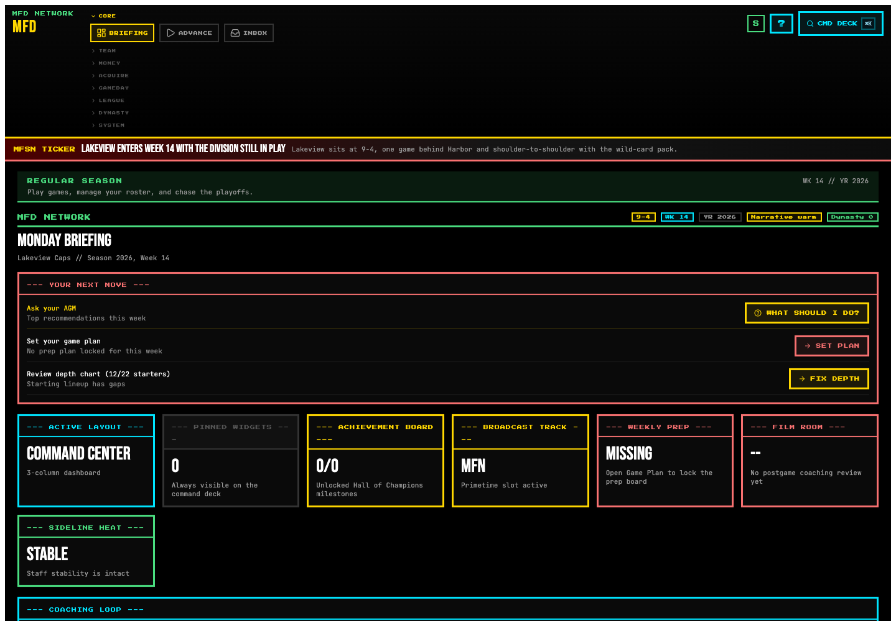
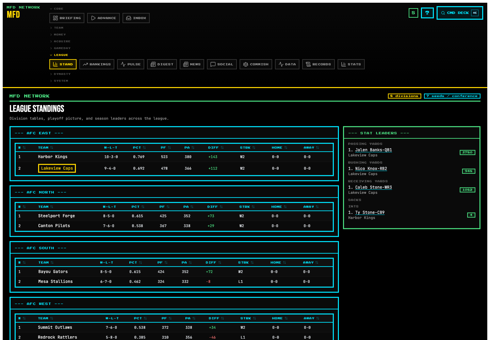
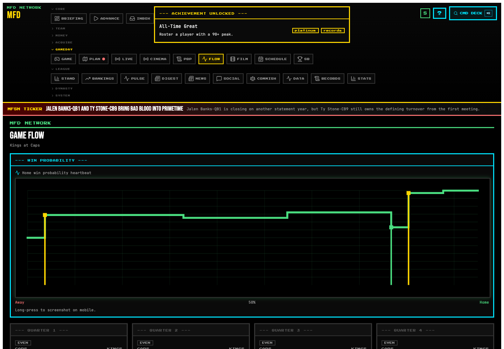
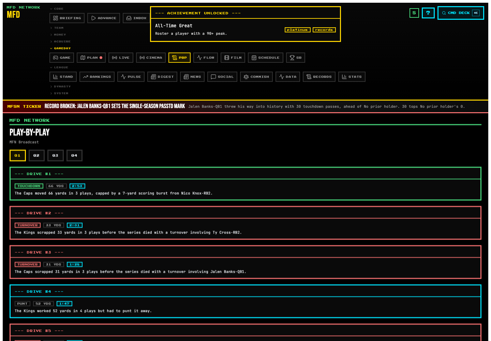
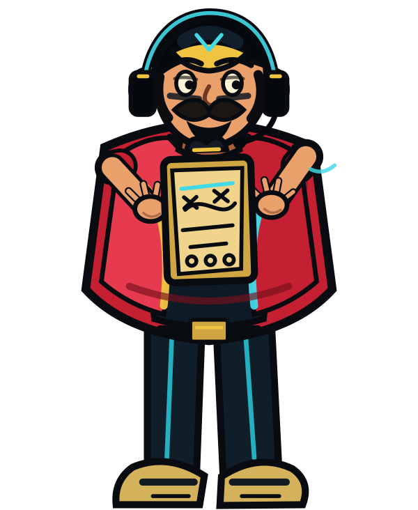

# Mr. Football Dynasty

Browser-based football franchise dynasty simulation. Build a team, manage the cap, survive the media cycle, and carry one save across seasons.

### ▶︎ [Play Now → kevinbigham.github.io/MFD](https://kevinbigham.github.io/MFD/)

**Version:** v1.0.0 · **Save schema:** v38

## Screenshots

| Dashboard | Standings |
|---|---|
|  |  |

| Game Flow | Play-by-Play |
|---|---|
|  |  |

More release shots:

- [GM career](apps/web/public/screenshots/v1/franchise-career.png)
- [Mobile dashboard](apps/web/public/screenshots/v1/dashboard-mobile.png)

## What It Is

MFD is a single-player franchise sim with deterministic seasons, seeded RNG, stable saves, and a client-side TypeScript engine.

- Draft, develop, extend, trade, and cut players across long-running dynasties.
- Manage cap space, dead money, restructures, extensions, franchise tags, CBA pressure, and owner patience.
- Build coaching staffs, weekly prep, game plans, locker room chemistry, facilities, and scouting departments.
- Watch games through broadcast packages, game flow, play-by-play, standings, records, awards, and media-cycle fallout.
- Preserve careers through Hall of Fame, franchise legends, bloodlines, timelines, scrapbook entries, and GM career history.
- Get coached by Chip — your in-game companion — across the cold open, weekly briefings, route guidance, halftime, recap, press, achievements, and high-stakes moments.

What it is not: a multiplayer service, a card collector, or a server-backed live-ops game. Everything runs in the browser.

## Meet Chip

Chip is your franchise's permanent sideline voice. He shows up across 36 distinct poses tied to in-game context — calling plays at halftime, working the phones at the trade deadline, rallying after a touchdown, head-in-hands when the cap projection breaks, fist-bumping when you lock in a decision, proud after an achievement unlock.

<p>
  
  
  
  
  
</p>

## Start A Dynasty

1. Open [MFD](https://kevinbigham.github.io/MFD/).
2. Pick a franchise and difficulty, or launch the convention demo.
3. Finish setup, advance weeks, and make decisions when the dashboard flags them.
4. Use Save/Load to export portable dynasty backups before switching browsers or machines.

## Tech Stack

TypeScript monorepo, pure engine package, React 19 web app, Zustand state, Dexie/IndexedDB saves, Vite build, Vitest coverage, GitHub Pages deploy. Chip's portrait set is generated procedurally from a single rig (`scripts/generate-chip-v3-art.cjs`), so the cast stays visually consistent across all poses.

## Contributor Setup

```bash
git clone git@github.com:KevinBigham/MFD.git
cd MFD
pnpm install

pnpm dev
pnpm --filter @mfd/engine test
pnpm --filter @mfd/web test
pnpm -r typecheck
pnpm --filter @mfd/web build
```

Launch gates:

```bash
# Full public-release contract (36 steps):
pnpm release:gate
```

Focused diagnostics:

```bash
bash scripts/check-math-random.sh
bash scripts/check-bundle-size.sh
bash scripts/smoke-full-season.sh
pnpm playtest:all
```

Regenerate Chip's portrait atlas (only needed if you add or change a pose):

```bash
node scripts/generate-chip-v3-art.cjs
```

## Release Notes

See [CHANGELOG.md](CHANGELOG.md). v1.0.0 ships with save schema v38 and the Sprint 72 deterministic playtest-report cleanup. Recent post-launch polish: the Chip companion has been rebuilt on a unified procedural rig, expanded from 17 → 36 poses, and wired into 11 previously-generic surfaces (training camp, trade deadline, expansion draft, halftime, recap, press, achievement-unlock toast, and more).

## License

Private project by Kevin Bigham.
